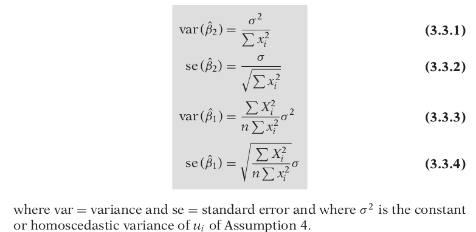

# Econometrics
- Econometrics means “economic measurement.”
- **Methodology**
  1. Statement of theory or hypothesis.
  2. Specification of the mathematical model of the theory
  3. Specification of the statistical, or econometric, model
  4. Obtaining the data
  5. Estimation of the parameters of the econometric model
  6. Hypothesis testing
  7. Forecasting or prediction
  8. Using the model for control or policy purposes.

### Models Div
- If the model has only one equation, as in the preceding example, it is called a single-equation model, whereas if it has more than one equation, it is known as a multiple-equation model
- The variable appearing on the left side of the equality sign is called the dependent variable and the variable(s) on the right side are called the independent, or explanatory, variable(s).

### Keynesian theory of consumption
- The marginal propensity to consume
(MPC), the rate of change of consumption for a unit (say, a dollar) change in income, is greater than zero but less than 1.
- Y = β1 + β2X,  0 < β2 < 1
- β2 measures the MPC.
- To allow for inexact relationships, Y = β1 + β2X + u, where u, known as the disturbance, or error, term, is a random (stochastic) variable that has well-defined probabilistic properties.

## THE NATURE OF REGRESSION ANALYSIS
- Regression analysis is concerned with the study of the dependence of one variable, the dependent variable, on one or more other variables, the explanatory variables, with a view to estimating and/or predicting the (population) mean or average value of the former in terms of the known or fixed (in repeated sampling) values of the latter.
- A statistical relationship in itself cannot logically imply causation.

#### Types of Data
1. Time Series - A time series is a set of observations on the values that a variable takes at different times.
2. Cross Section - Cross-section data are data on one or more variables collected at the same point in time
3. Pooled - elements of both time series and cross-section data

- The researcher should always keep in mind that the results of research are only as good as the quality of the data.

## TWO-VARIABLE REGRESSION ANALYSIS: SOME BASIC IDEAS
- Conditional Mean & Unconditional Mean
- PRF (population regression function) states that the expected value of the distribution of Y given Xi is functionally related to Xi i.e. E(Y | Xi) = f (Xi)
- Linearity - 1. Linear in Var , 2. Linear in Params
- Granted that the SRF is but an approximation of the PRF, can we devise a rule or a method that will make this approximation as “close” as possible?

## TWO-VARIABLE REGRESSION MODEL: TH PROBLEM OF ESTIMATION

#### THE METHOD OF ORDINARY LEAST SQUARES
- Yi = Ŷi + ûi
=> ûi = Yi − Ŷi
= Yi − β̂1 − β̂2 Xi
- Now given n pairs of observations on Y and X, we would like to determine the SRF in such a manner that it is as close as possible to the actual Y. To this end, we may adopt the following  criterion: Choose the SRF in such a way that the sum of the residuals ûi = (Yi − Ŷi ) is as small as possible.
- That is minimize the sum of the sqaures of ûi.

#### Assumptions of the CLRM
1. The regression model is linear in the parameters, i.e. Yi = β1 + β2Xi + ui
2. X values are fixed in repeated sampling
3. Zero mean value of disturbance ui, i.e. E(ui |Xi) = 0
4. Homoscedasticity or equal variance of ui, i.e. var (ui | Xi) = E [ui − E(ui | Xi)]^2 = E (ui^2 | Xi) = σ^2
5. No autocorrelation between the disturbances, i.e. cov (ui, uj | Xi, Xj ) = E {[ui − E (ui)] | Xi }{[uj − E(uj)] | Xj } = E(ui | Xi)(uj | Xj) = 0
6. Zero covariance between ui and Xi or E(uiXi) = 0.
7. The number of observations n must be greater than the number of parameters to be estimated
8. Variability in X values, i.e. var (X ) must be a finite positive number.
9. The regression model is correctly specified
10. There is no perfect multicollinearity. That is, there are no perfect linear relationships among the explanatory variables

#### Gauss–Markov Theorem: 
Given the assumptions of the classical linear regression model, the least-squares estimators, in the class of unbiased linear estimators, have minimum variance, that is, they are BLUE.

- The square of the coefficient of correlation(r) = sum(xiyi)/sqrt(sum(xi^2)*sum(y1^2)) can be used as a measure of goodness of the model. 

## CLASSICAL NORMAL LINEAR REGRESSION MODEL (CNLRM)
